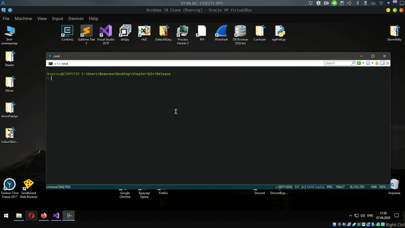

# :unlock: FireFox-Thief
Decrypt **gecko** based browsers passwords, cookies, history, bookmarks.  
[Need new chromium passwords decryptor?](https://github.com/LimerBoy/Adamantium-Thief)

# :herb: Examples:  

### :key: Get passwords from browsers:
``` batch
Stealer.exe PASSWORDS
```
<p align="center">
  
</p>

### :clock9: Get history from browsers:
``` batch
Stealer.exe HISTORY
```
<p align="center">
  
</p>

### :bookmark_tabs: Get bookmarks from browsers:
``` batch
Stealer.exe BOOKMARKS
```
<p align="center">
  
</p>

### :cookie: Get cookies from browsers:
``` batch
Stealer.exe COOKIES
```
<p align="center">
  
</p>


# :globe_with_meridians: Browsers list:
* Firefox
* Waterfox
* Cyberfox
* K-Meleon
* Thunderbird
* IceDragon
* BlackHaw
* Pale Moon

 
